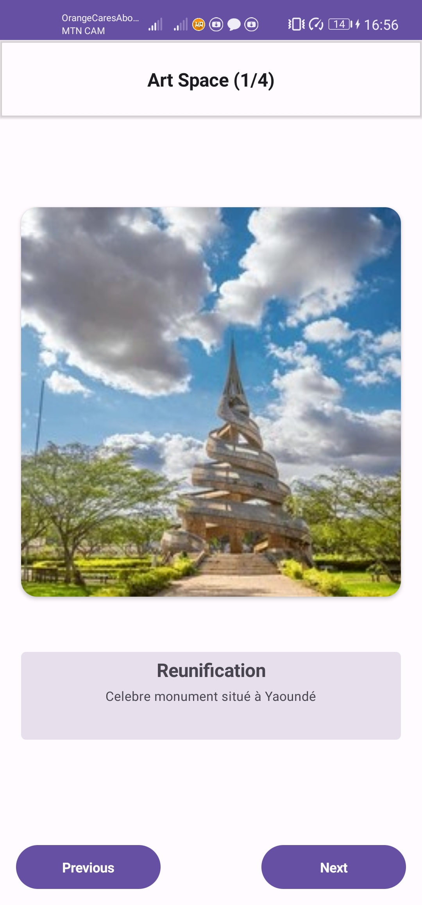
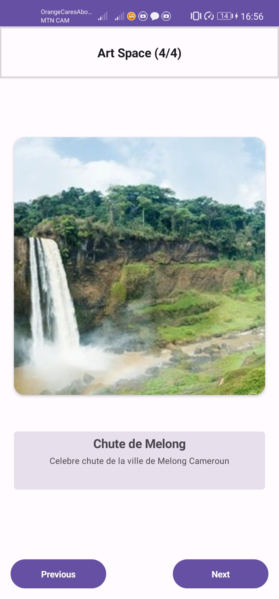

### Projet ArtSpace

Projet Scolaire de conception d'une Application de mobile de visualisation et de navigation à travers les informations d'art inserer dans la plateforme.
Ce ci fait l'objet d'un devoir du cours de <strong>d'Atelier de Developpement Mobile</strong> dispensé par <a href="https://github.com/giressesama237">M. HYOUBISSIE </a>

#### Etape de la conception
<ol>
  <li>Creation d'une UI statique avec des composable</li>
  <li>Elaboration de l'interactivité de l'application</li>
  <li>Mise à jour des elements afin de les adapter à differentes tailles d'ecran</li>
</ol>

#### Visuels du resultats

  
  
  
  

#### Equipe
<ul>
  <li>MBOHOU MOUNPOU YVAN LANDRY    20G00235</li>
  <li>NDOP-MFONKOUA DIVA PAMELA    20G00384</li>
  <li>MFONKOA ZAMBOU EMMANUEL      20G002</li>
</ul>
